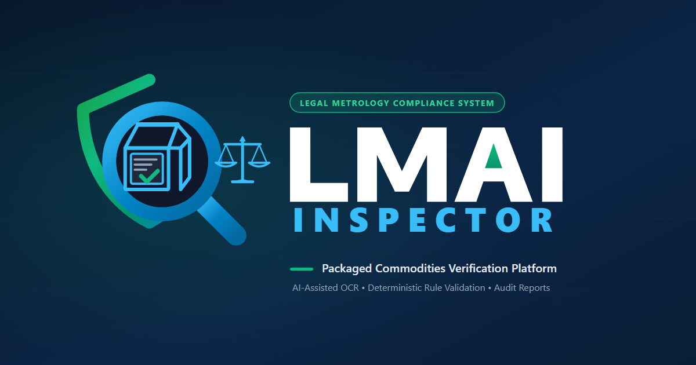

# LMAI Inspector

> **Automated Legal Metrology inspection-support system for packaged commodity declarations under the Legal Metrology (Packaged Commodities) Rules, 2011.**

[](https://www.sih.gov.in/)
[](https://www.sih.gov.in/)
[](https://github.com/SayanModakDev/SIH-Project)
[](https://lmai-inspector.vercel.app)

---

### 🚀 Live Prototype
**[https://lmai-inspector.vercel.app](https://lmai-inspector.vercel.app)**  
*Explore the live interactive inspection workstation, multi-image evidence screening, and PDF report generation.*

---

## 📌 Problem Statement (SIH26034)

Under the **Legal Metrology (Packaged Commodities) Rules, 2011** and the **Legal Metrology Act, 2009**, every pre-packaged commodity manufactured, packed, or imported for sale in India must bear mandatory declarations:

- Name and address of the manufacturer, packer, or importer (Rule 6(1)(a))
- Generic or common name of the commodity (Rule 6(1)(b))
- Net quantity in standard units of weight, measure, or number (Rule 6(1)(c), Rule 12, Rule 13)
- Month and year of manufacture, packing, or import (Rule 6(1)(d))
- Maximum Retail Price (MRP) inclusive of all taxes (Rule 6(1)(e))
- Consumer care contact details (Rule 6(1)(n))
- Country of origin for imported goods (Rule 6(10))

### Key Challenges for Enforcement Officers:
1. **Multi-Panel Fragmentation:** Mandatory declarations are rarely printed on a single panel; inspectors must cross-examine front, back, side, and base packaging surfaces.
2. **Repetitive Manual Workload:** Field officers process dozens of packaging inspections daily, making manual transcription error-prone and labor-intensive.
3. **Complex Regulatory Applicability:** Rules and exemptions shift depending on package type (Retail vs. Wholesale), commodity category (Food vs. Cosmetics vs. General), and origin (Domestic vs. Imported).
4. **Uncertain Optical Evidence:** Curvature, specular reflections, creased foil, and low-contrast typography create OCR ambiguities that cannot be blindly trusted.
5. **Physical Testing Boundaries:** Digital images cannot weigh commodities or verify physical font millimeter heights; physical inspection equipment (calibrated balances, calipers) remains statutorily indispensable.

---

## 💡 Our Solution: LMAI Inspector

**LMAI Inspector** is a production-oriented, explainable **automated inspection-support system** engineered specifically for Legal Metrology officers. It accelerates evidence discovery across packaging panels while ensuring deterministic compliance evaluation and maintaining strict human-in-the-loop governance.

### Core Architectural Principle
> **"Computer vision and OCR are used for extraction and evidence discovery; deterministic rule logic evaluates statutory compliance."**

LMAI Inspector does **not** rely on opaque black-box AI predictions to determine legal violations. Instead, it parses visual evidence into structured declaration tokens, normalizes units and numerical values, evaluates them deterministically against an official Legal Metrology rule matrix, and surfaces discrepancies to the inspector for physical verification.

```
Product Images (Multi-Panel)
             ↓
Optical Character Recognition & Computer Vision
             ↓
Structured Evidence & Entity Extraction
             ↓
Quantity, Unit & Declaration Sanitization
             ↓
Deterministic Regulatory Rule Matrix (LMPC Rules, 2011)
             ↓
Statutory Invariants: PASS | FAIL | REVIEW REQUIRED | N/A
             ↓
Inspector Verification & Physical Scale Integration
             ↓
Government-Facing PDF Inspection Report
```

---

## ⚙️ How It Works

1. **Multi-Image Evidence Ingestion:** The inspector captures or uploads multiple packaging panels (front, back, nutritional panel, base). The pipeline processes each panel independently and fuses extracted tokens into a single unified inspection record.
2. **Computer Vision & Optical Character Recognition:** PaddleOCR extracts localized text tokens with spatial bounding boxes (`[x1, y1, x2, y2]`) and character-level confidence scores.
3. **Structured Parameter Extraction:** Regex-based spatial parsers identify key statutory entities: MRP, Declared Net Quantity, Manufacturer/Packer addresses, Dates, Consumer Care phone/email, and Country of Origin.
4. **Metric Sanitization & Decomposition:** Net quantity declarations are decomposed into numerical values and metric units (`g`, `kg`, `ml`, `l`, `m`, `cm`), checking against standard units under the Legal Metrology rules. Multipack declarations (e.g., `4 x 100 g = 400 g`) are validated for mathematical and syntactic consistency.
5. **Product Familiarity Reference Layer:** Decoded barcodes (EAN-13, UPC) and brand tokens query a generic 5-tier product registry to offer supporting evidence and improve OCR candidate ranking without fabricating declarations or automatically granting legal compliance.
6. **Deterministic Rule Matrix Evaluation:** The normalized declarations are evaluated against versioned statutory screening rules mapped from the Legal Metrology (Packaged Commodities) Rules, 2011, FSSAI regulations, and statutory instruments.
7. **Inspector Verification & Audit Trail:** If evidence is ambiguous, conflicting, or missing, the parameter is flagged as `REVIEW REQUIRED`. The inspector can verify or correct the value in the Inspector Review workstation. Previous OCR readings are permanently archived as `OCR_SUPERSEDED` evidence.
8. **Statutory Report Generation:** A tamper-evident, multi-page ReportLab PDF inspection report is generated, complete with rule evaluations, panel images, extracted declaration audits, regulatory citations, and officer sign-off blocks.

---

## 🔍 Compliance Decision Model

LMAI Inspector enforces four strict, deterministic evaluation states:

| Status | Definition | Operational Meaning |
| :--- | :--- | :--- |
| **`PASS`** | Requirement is deterministically satisfied by extracted or verified declarations. | Declaration is present, legible, uses approved metric units, and conforms to statutory formatting. |
| **`FAIL`** | Clear deterministic evidence establishes statutory non-compliance. | Declaration is demonstrably non-compliant (e.g. non-standard units, invalid expression, statutory violation). |
| **`REVIEW REQUIRED`** | Evidence is insufficient, ambiguous, conflicting across packaging panels, or requires physical testing. | Mandatory declaration was not detected with high confidence, conflicting values exist, or physical scale weight is required. Never marked as FAIL simply because OCR missed it. |
| **`NOT APPLICABLE`** | The rule is legally exempt or excluded for the selected inspection scope. | Excluded by category (e.g. FSSAI-specific rules on non-food), package type (Wholesale exemption), or import status. |

> [!IMPORTANT]
> **No Black-Box Compliance Decisions:** A reference product match or high OCR confidence score **never** automatically produces a `PASS` or declares legal compliance. Missing declarations are never hallucinated.

---

## ✨ Key Features

- **Multi-Panel Synthesis:** Ingests and correlates multiple package angles in a single inspection, resolving cross-panel declaration ambiguities.
- **Explainable Rule Matrix:** 30+ versioned screening rules categorized by commodity type (`FOOD`, `COSMETIC`, `ALL`) and package applicability (`RETAIL`, `WHOLESALE`, `INSTITUTIONAL`).
- **Metric Unit & Multipack Validation:** Strictly verifies standard units under Rule 12 and decomposes complex multipack expressions into pack counts, unit quantities, and derived total net quantities.
- **Product Familiarity Layer:** Extensible 5-tier matching priority (GTIN/Barcode → Barcode + Brand → Brand + Quantity → Name Similarity → No Match) that assists candidate ranking while preserving statutory independence.
- **Inspector Review Workstation:** Review spatial bounding boxes, resolve cross-image conflicts, and submit manual overrides with instant deterministic rule re-evaluation.
- **Traceable Audit Chain:** Machine extraction → Review required → Inspector verified value → Rule re-evaluation → Final report. Original OCR evidence is never erased or overwritten.
- **Physical Verification Integration:** Dedicated input fields for certified digital electronic scale readings (Rule 19 / Third Schedule MPE tolerances) and caliper dimension measurements.
- **Government-Facing PDF Reports:** Comprehensive ReportLab PDF dossiers containing summary metrics, full rule matrices, packaging panel photos, declaration audits, legal citations, and official sign-off blocks.
- **Zero-Cloud Local Privacy:** Core OCR, vision, extraction, and rule evaluation run locally without external cloud AI dependencies or privacy risks.

---

## 🏛️ Inspector-in-the-Loop Governance

LMAI Inspector is explicitly positioned as an **inspection-support screening aid**, not an autonomous judicial decision-maker:

1. **OCR Uncertainty Management:** Optical character recognition on metallic foils, cylindrical cans, and crinkled pouches can produce errors. The system never converts low-confidence OCR into legal violations.
2. **Preservation of Evidence:** Every manual override stores the original OCR token as `OCR_SUPERSEDED` evidence alongside the `MANUAL_OVERRIDE` record, ensuring an unbroken evidentiary chain for judicial scrutiny.
3. **Physical Limits of Vision:** Software cannot weigh physical commodity contents, determine density, or measure physical font height in millimeters on an uncalibrated display. These requirements are explicitly designated as `PHYSICAL_VERIFICATION_REQUIRED`.
4. **Officer Discretion:** The system provides structured recommendations and citations; final statutory enforcement actions (issuing notices under Section 39 / Rule 32, detaining goods, or laboratory sampling) remain entirely with the authorized Legal Metrology officer.

---

## 🖥️ System Walkthrough

### 1. New Inspection & Scope Selection
Officers configure the statutory inspection scope (`Package Type: Retail / Wholesale`, `Import Status: Domestic / Imported`) and upload packaging panel images.



### 2. Evidence Workstation & Candidate Ranking
The system visualizes extracted declaration tokens alongside detected options, confidence scores, and advisory familiarity suggestions.

### 3. Compliance Rule Matrix & Re-Evaluation
Every applicable rule displays its parameter, extracted value, validation method, binary result (1/0/Review), statutory citation, and legal reference.

### 4. Official PDF Inspection Report
A multi-page statutory report generated via ReportLab is archived and downloadable for case documentation and enforcement proceedings.


---

## 🏗️ Technical Architecture

```
┌────────────────────────────────────────────────────────┐
│             Frontend (React 18 + Vite)                │
│    Responsive Dashboard • Evidence Workstation • UI    │
└───────────────────────────┬────────────────────────────┘
                            │ HTTPS / REST API
┌───────────────────────────▼────────────────────────────┐
│              Backend (FastAPI / Python 3.11)           │
│  API Routing • Schemas • Database Sessions • Lifecycle │
└──────────┬─────────────────┬───────────────────┬───────┘
           │                 │                   │
┌──────────▼───────┐  ┌──────▼────────────┐  ┌───▼───────┐
│ OCR & Vision     │  │ Product Registry  │  │ Rules     │
│ - PaddleOCR      │  │ - 5-Tier Matcher  │  │ - Matrix  │
│ - OpenCV Filters │  │ - Barcode Decodes │  │ - Scoping │
│ - BBox Mapping   │  │ - Supporting Spec │  │ - Evaluator
└──────────┬───────┘  └──────┬────────────┘  └───┬───────┘
           │                 │                   │
           └─────────────────┼───────────────────┘
                             │
┌────────────────────────────▼───────────────────────────┐
│          Reporting & Persistence (SQLite / MySQL)      │
│  - SQLAlchemy ORM Model Storage                        │
│  - ReportLab Multi-Page PDF Engine with NumberedCanvas │
└────────────────────────────────────────────────────────┘
```

### Technology Stack

| Layer | Technologies Used |
| :--- | :--- |
| **Frontend** | React 18, Vite, Lucide React, React Router 6, Vanilla CSS Design System |
| **Backend API** | FastAPI, Python 3.11, Pydantic v2, Uvicorn, AnyIO |
| **Computer Vision & OCR** | PaddleOCR, OpenCV (cv2), PIL (Pillow), NumPy |
| **Barcode & Registry** | PyZbar, Barcode Decoder, In-Memory GTIN Index, JSON Catalog |
| **Compliance Engine** | Deterministic Python Rule Engine, Configurable Rule Matrix (`rule_matrix.json`) |
| **PDF Reporting** | ReportLab (Flowables, Tables, NumberedCanvas, Vector Badges) |
| **Database** | SQLite (Default / Local Demo), MySQL 8.0 support via SQLAlchemy |
| **Production Deployment** | Vercel (Frontend), Oracle Cloud Infrastructure Linux VM (Backend), Caddy (Reverse Proxy & Automatic TLS) |

---

## 🧪 Verification & Test Suite

The repository contains an exhaustive automated test suite covering regulatory logic, OCR robustness, candidate ranking, multi-image merging, and PDF generation:

```bash
# Run full automated test suite (372 passed)
pytest backend/tests/ -v
```

### Test Coverage Highlights:
- **`test_product_registry.py`:** Verifies all 5 matching tiers (Barcode, Brand, Quantity, Name Similarity, Fallback) and confirms product matches never alter statutory PASS/FAIL compliance decisions.
- **`test_pdf_report.py`:** Validates 4-page PDF document generation, NumberedCanvas total page counts, and ensures the complete audit trail (original OCR + inspector verified values) is accurately rendered.
- **`test_final_integration_audit.py`:** Tests statutory rule compliance across food, cosmetics, multipack quantity decomposition, date contexts, and the `/health` endpoint.
- **Frontend Code Quality:** `npm run lint` passes with **0 errors and 0 warnings**; `npm run build` generates a production-optimized bundle in under 2 seconds.

---

## 🚀 Local Development Setup

### Prerequisites
- Python 3.11+
- Node.js 18+ & npm
- Git

### Quick Start (Windows)
From the repository root:
```cmd
./start_app.bat
```
- **Frontend Workstation:** `http://localhost:5173`
- **Backend API & Docs:** `http://localhost:8000/docs`

To gracefully shut down all services:
```cmd
./stop_app.bat
```

### Manual Setup

1. **Backend Setup:**
   ```bash
   cd backend
   python -m venv venv
   source venv/bin/activate  # Or venv\Scripts\activate on Windows
   pip install -r requirements.txt
   python -m uvicorn app.main:app --host 0.0.0.0 --port 8000 --reload
   ```

2. **Frontend Setup:**
   ```bash
   cd frontend
   npm install
   npm run dev
   ```

---

## 👥 Team & Attribution

Developed for the **Smart India Hackathon 2026** by:

- **Team Name:** BWU SolveArc
- **Institution:** Brainware University
- **Problem Statement ID:** SIH26034

---

## ⚖️ Statutory Disclaimer

> **LMAI Inspector is an automated inspection-support screening tool.** It assists authorized personnel with evidence extraction, label screening, and structured rule evaluation under the Legal Metrology (Packaged Commodities) Rules, 2011. Inspection outputs do not constitute legal certificates or statutory enforcement orders. Final regulatory determinations, notices, and product detentions must be performed by authorized Legal Metrology officers in accordance with statutory procedures.

---

## 🌐 Try the Prototype

### 🚀 **[https://lmai-inspector.vercel.app](https://lmai-inspector.vercel.app)**

*Built for Smart India Hackathon 2026 — Problem Statement SIH26034*
